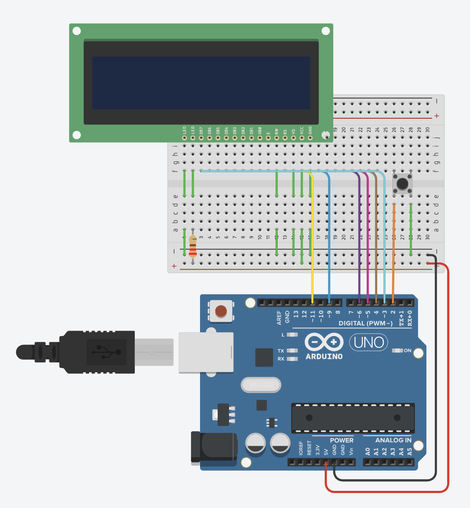

# Arduino Uno Jumpman Game

A simple side-scrolling Jumpman-style game for the Arduino Uno using a 16×2 LCD screen and push button. The player controls a character who must jump over obstacles to survive as long as possible.

---

## 🎮 Gameplay

- Your character runs automatically from left to right.
- Obstacles appear on either the top or bottom row.
- Press the **jump button** to leap over obstacles.
- The game ends when you collide with an obstacle.
- The score is displayed at the top-right (measured by distance survived).

---

## 🛠 Hardware Requirements

- **Arduino Uno** (or compatible board)
- **16×2 LCD Display** (HD44780-compatible)
- **Push button** for jumping
- **1 220 Ohm Resistor**
- **Breadboard & jumper wires**

---

## ⚙ Wiring

### Circuit Image

---
## 📦 Installation

1. Install the [LiquidCrystal](https://www.arduino.cc/en/Reference/LiquidCrystal) library (usually pre-installed with the Arduino IDE).
2. Clone or download this repository.
3. Open the `.ino` file in the Arduino IDE.
4. Upload to your Arduino Uno.
5. Connect the hardware as described above.

---

## ▶ How to Play

1. Power on the Arduino with the LCD and button connected.
2. When “Press Start” appears, press the button to begin.
3. Avoid hitting obstacles by pressing the button to jump.
4. Survive as long as possible to increase your score.
5. If you collide, the game resets to the start screen.

---

## 🔍 Code Overview

- **Custom Characters:** Uses `lcd.createChar()` to create pixel graphics for the running, jumping, and ground tiles.
- **Terrain Generation:** Randomly generates top or bottom obstacles of varying lengths.
- **Collision Detection:** Checks if the hero’s current position overlaps with an obstacle.
- **Scoring:** Increases as distance traveled (`distance >> 3`).

---

## 📸 Demo

<video controls src="IMG_2191.mp4" title="Title"></video>
